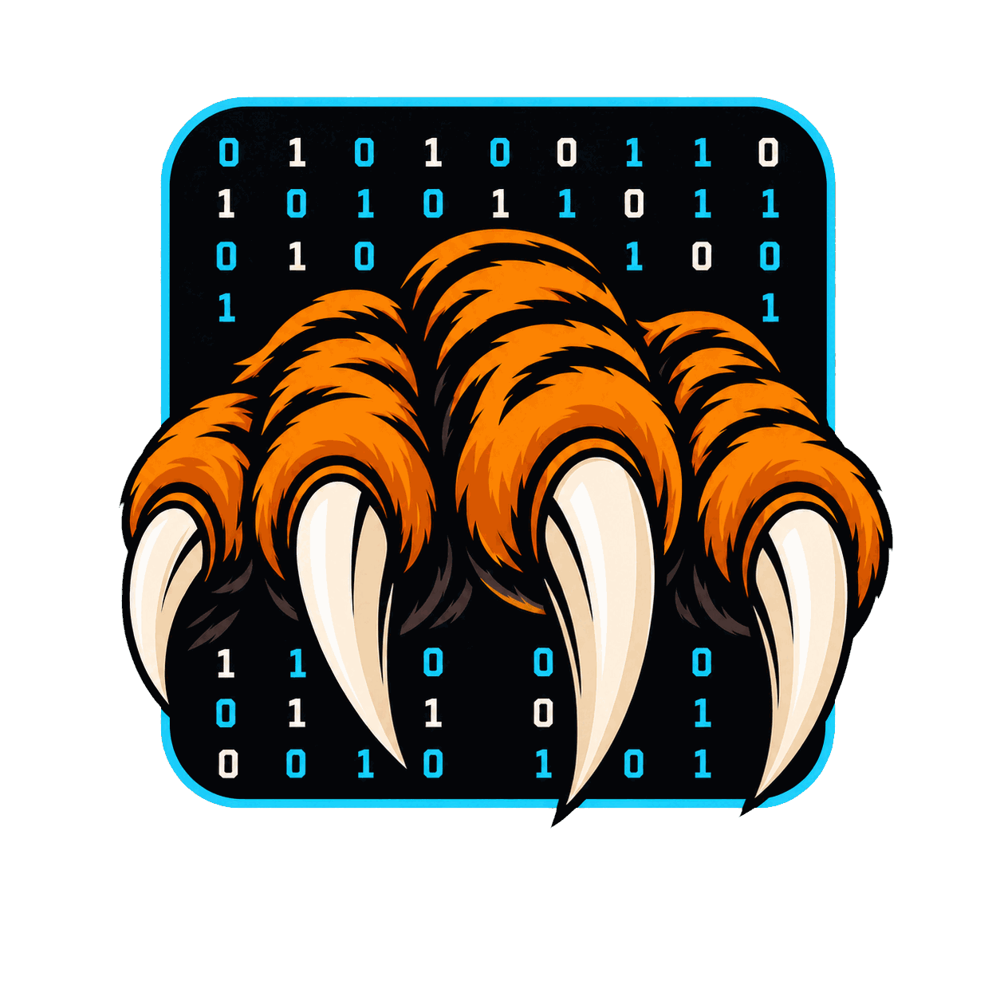

<!-- SPDX-License-Identifier: MPL-2.0 -->

# rawr



Roaring bitmap library in pure Zig. Wire-compatible with CRoaring (serialized
bitmaps interoperate across implementations). No C dependencies.

rawr supports mutation, set operations, positional queries (`rank`/`select`),
inclusive range operations, n-way union/xor, bulk add/remove/extract, and
zero-copy reads. See [API.md](API.md) for the full reference and footgun notes.

## Interop

Implements the [RoaringFormatSpec](https://github.com/RoaringBitmap/RoaringFormatSpec)
portable serialization format. Bitmaps serialized by rawr can be read by CRoaring,
Java RoaringBitmap, Go roaring, and any other compliant implementation — and vice
versa. Validated by `zig build validate` which round-trips through both rawr and
CRoaring.

`Roaring64Bitmap` uses CRoaring's `roaring64` portable format and is validated by
`zig build validate64`. Java's 64-bit Roaring layouts differ and are not
supported or tested by rawr's 64-bit serializer.

See [API.md](API.md) for the full API reference.

### 32-bit targets

rawr is compile-checked on `wasm32-freestanding`, `x86-linux-musl`,
`arm-linux-musleabi`, `riscv32-linux`, and `x86-linux-baseline`;
`x86-linux-musl` is also exercised natively by the unit, differential, and
cross-width serialization suites. Run the compile matrix with
`zig build check-32`.

A 32-bit process has roughly 2-4 GB of usable address space. A worst-case dense bitmap can require
512 MB for container payloads alone, before bitmap, allocator, and process overhead, so allocation
failure is substantially more likely than on 64-bit targets.

## Usage

```zig
const rawr = @import("rawr");
const RoaringBitmap = rawr.RoaringBitmap;

// Create and populate
var bm = try RoaringBitmap.init(std.heap.smp_allocator);
defer bm.deinit();

_ = try bm.add(1);
_ = try bm.add(2);
_ = try bm.add(3);
_ = try bm.addRange(100, 200);  // adds 100..200 inclusive

// Query
assert(bm.contains(150));
assert(!bm.contains(50));
const card = bm.cardinality(); // 104

// Iterate
var it = bm.iterator();
while (it.next()) |value| {
    // values in sorted order: 1, 2, 3, 100, 101, ..., 200
}

// Set operations (allocate new bitmap)
var other = try RoaringBitmap.init(std.heap.smp_allocator);
defer other.deinit();
_ = try other.addRange(150, 250);

var intersection = try bm.bitwiseAnd(std.heap.smp_allocator, &other);
defer intersection.deinit();
// intersection contains 150..200

// Set operations (in-place, no allocation)
try bm.bitwiseOrInPlace(&other);
// bm now contains 1, 2, 3, 100..250

// Serialize (CRoaring-compatible wire format)
const bytes = try bm.serialize(std.heap.smp_allocator);
defer std.heap.smp_allocator.free(bytes);

// Deserialize trusted bytes
var restored = try RoaringBitmap.deserialize(std.heap.smp_allocator, bytes);
defer restored.deinit();

// Deserialize untrusted bytes with semantic validation
var safe = try RoaringBitmap.deserializeSafe(std.heap.smp_allocator, bytes);
defer safe.deinit();
```

Mutation and query range APIs are inclusive. `addRange(100, 200)` adds 101
values; `Roaring64Bitmap.fromRange` is a half-open stepped constructor.

### Bitmap types

| Type | Use when |
|------|----------|
| `RoaringBitmap` | You need mutation, in-place set operations, or long-lived ownership. |
| `Roaring64Bitmap` | Values may exceed `u32`. |
| `OwnedBitmap` | You want an arena-backed read-only result that frees in one call. |
| `FrozenBitmap` | You have serialized bytes and want zero-copy lookup. |
| `Frozen64Bitmap` | You have a rawr-native frozen64 image and want zero-copy lookup. |

### OwnedBitmap (arena-backed read-only results)

`OwnedBitmap` uses arena allocation internally — all container memory is freed
in one operation. It exposes read-only access and has no individual `remove()`.

```zig
const OwnedBitmap = rawr.OwnedBitmap;

// Deserialize with arena allocation
var owned = try RoaringBitmap.deserializeOwned(std.heap.smp_allocator, bytes);
defer owned.deinit(); // frees everything at once

assert(owned.contains(42));
const card = owned.cardinality();
const min = owned.asBitmap().minimum(); // full read-only RoaringBitmap API
var it = owned.iterator();

// Set operations
var result = try bm.bitwiseAndOwned(std.heap.smp_allocator, &other);
defer result.deinit();
```

### FrozenBitmap (zero-copy, zero-alloc)

Operates directly on a serialized byte buffer. No deserialization, no heap
allocation. Read-only.

```zig
const FrozenBitmap = rawr.FrozenBitmap;

var frozen = try FrozenBitmap.init(bytes);
defer frozen.deinit();

assert(frozen.contains(42));
const card = frozen.cardinality();
var it = frozen.iterator();
```

## Allocator guidance

Allocator choice controls ownership, lifetime, memory bounds, and whether libc
must be linked. Match those properties to the application rather than assuming
one allocator fits every operation.

| Allocator or API | Characteristics | Use when |
|---|---|---|
| `OwnedBitmap` API | Arena-backed read-only ownership with one `deinit` | Results share a single lifetime. |
| `std.heap.ArenaAllocator` | Allocations are released together | Multiple mutable bitmaps share a bulk-free lifetime. |
| `std.heap.smp_allocator` | General-purpose Zig allocator with independent frees | Mutable bitmaps have independent lifetimes. |
| `std.heap.FixedBufferAllocator` | Uses caller-provided storage with a fixed bound | The maximum memory budget is known. |
| `std.heap.c_allocator` | Uses libc allocation and requires libc linkage | C interoperability or an application already standardized on libc allocation. |

A `FixedBufferAllocator` can be reset and reused when repeated work has a known
memory bound and common lifetime.

## Building

Requires Zig 0.16.0+.

```bash
zig build              # build library
zig build test         # run tests
zig build validate     # CRoaring interop validation
zig build bench        # rawr-only benchmarks
zig build bench-compare # quick CRoaring screening dashboard
zig build bench-alloc  # allocator matrix experiment
```

The vendored CRoaring reference build disables AVX512 by default for portable
Zig 0.16 builds. Use `-Dcroaring-avx512=true` when comparing against an AVX512
CRoaring build on a compatible x86-64 target and toolchain.

Run benchmarks (results saved to `misc/`):

```bash
./scripts/run-bench.sh           # rawr benchmarks
./scripts/run-compare-bench.sh   # canonical isolated CRoaring parity table
./scripts/run-compare-bench.sh --dashboard # quick non-authoritative screening dashboard
./scripts/run-bench-alloc.sh     # allocator matrix experiment
```

## Internals

rawr implements the three container types defined by the Roaring format:

- **Array containers** — sorted u16 arrays for sparse chunks (<4096 values)
- **Bitset containers** — 8KB bitmaps for dense chunks, SIMD via `@Vector(8, u64)`
- **Run containers** — run-length encoded for sequential ranges

Key implementation details:

- SIMD bitset operations (OR/AND/XOR/ANDNOT) via `@Vector`, lowers to
  AVX-512/AVX2/NEON depending on target
- Branchless merge walks for array container intersection/union
- Run-aware `addRange` — creates run containers directly instead of
  element-by-element insertion
- Bulk I/O serialization — descriptive headers and container data written
  in single operations, no per-element loops
- Arena-friendly allocation — all container init/deinit goes through
  `std.mem.Allocator`, works with any Zig allocator

## Project structure

Main files and source families:

```
check_docs.zig       # API.md public-method and export guard
check_package.zig    # allowlist-only downstream package check
src/
  roaring.zig         # public module root
  bitmap.zig          # RoaringBitmap, OwnedBitmap (public API)
  roaring64.zig       # Roaring64Bitmap
  frozen.zig          # FrozenBitmap zero-copy view
  frozen64.zig        # Frozen64Bitmap rawr-native zero-copy view
  bitmap_tests.zig    # unit tests for bitmap.zig
  array_container.zig # sorted u16 array container
  array_kernels.zig   # array-operation kernel selection
  array_simd.zig      # architecture-specific array kernels
  bitset_container.zig # 8KB bitset container
  run_container.zig   # run-length encoded container
  container.zig       # tagged union over container types
  container_ops.zig   # cross-container set operations (9 type pairs)
  range_ops.zig       # mutation and query range implementations
  serialize.zig       # RoaringFormatSpec serialize/deserialize
  optimize.zig        # runOptimize, container type conversions
  compare.zig         # isSubsetOf, equals
  format.zig          # format constants
  *_tests.zig         # unit, range, property, and 64-bit suites
  roaring64_test_*.zig # 64-bit generators and shared test support
  test_gen.zig        # 32-bit deterministic test generation
  diff_test*.zig      # CRoaring differential tests
  validate_*.zig      # CRoaring interoperability validation
  bench*.zig          # benchmark and diagnostic executables
tools/
  check_32_api.zig    # compile-only public API reachability probe
  cross_width_fixture.zig # deterministic 32/64-bit serialization fixture
  croaring_wrapper.h  # rawr-owned translate-c adapter
  croaring_*.{c,h}    # CRoaring diagnostic adapters
  bench_*.{c,h}       # platform measurement helpers
  parse-*.awk         # profiler output parsers
vendor/
  roaring.c, roaring.h # CRoaring amalgamation (for benchmarks/validation only)
  LICENSE-CRoaring     # upstream Apache-2.0/MIT license text
```

The downstream Zig package contains the library and its unit-test sources. The
CRoaring amalgamation, translate-C adapter, validation executables, differential
tests, and benchmark drivers are repository-only development tooling.

## License

Original rawr code is licensed under the [Mozilla Public License 2.0](LICENSE).
When MPL-covered rawr files are distributed with modifications, those files and
their modifications must remain available under MPL-2.0. Separate applications
and source files that merely import, link to, or use rawr may remain proprietary
or use another license.

Third-party files under `vendor/` retain their upstream licenses and are not
covered by rawr's MPL-2.0 license. See [THIRD_PARTY_NOTICES.md](THIRD_PARTY_NOTICES.md)
for details.
